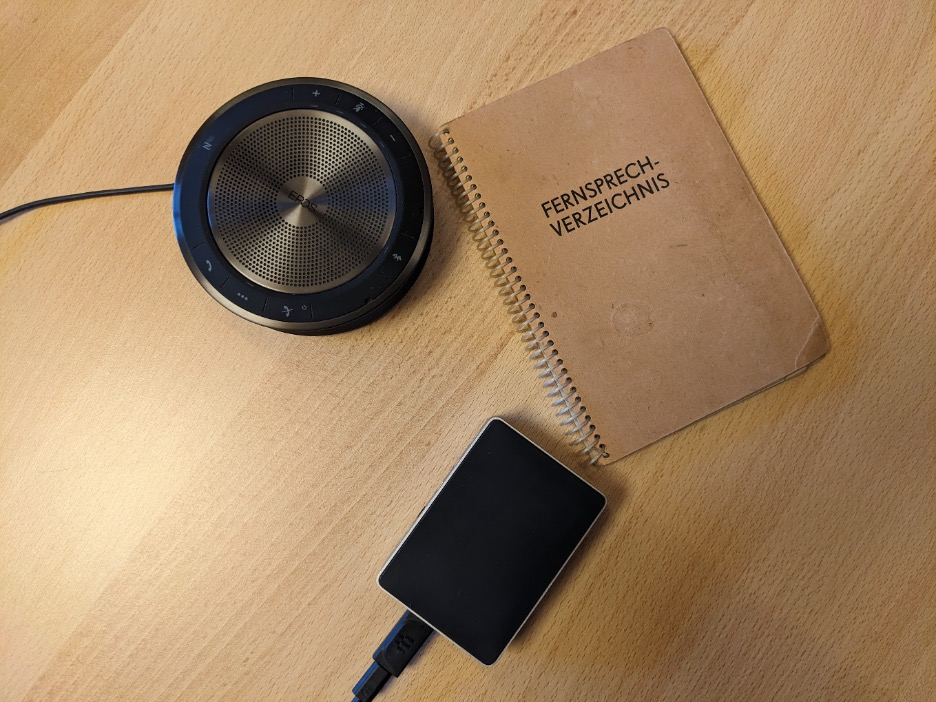

---
# Feel free to add content and custom Front Matter to this file.
# To modify the layout, see https://jekyllrb.com/docs/themes/#overriding-theme-defaults
---

# Hands-Free-Phone – Ein Open-Source-Sprachassistent für Telefonsoftware

## Problemstellung

Menschen mit taktilen Einschränkungen können ein Telefon nicht oder nur mit größter Anstrengung bedienen. 
Das Aufrufen oder Einspeichern von Kontakten sind mehrstufige Prozesse mit vielen Eingaben. 
Das Wählen von Nummern und Kontakten und das Annehmen von Telefonaten ist schwierig bis unmöglich. 
Die Erreichbarkeit, das Erledigen von Aufgaben und die Aufrechterhaltung von sozialen Kontakten sind deshalb 
stark beeinträchtigt. Bei schlimmen gesundheitlichen und körperlichen Problemen könnte das Telefon eine der 
wenigen verbliebenen Möglichkeiten sein, den Kontakt zu anderen Personen aufrechtzuerhalten.
Darüber hinaus kann die Spracheingabe auch für Personen ohne Einschränkungen einen schnelleren und einfacheren 
Zugang zu Funktionen eines Telefons bereitstellen. Eine IT-Lösung, die eine Steuerung eines Telefons per Sprache 
erlaubt, würde eine große Hilfe darstellen. Eine solche Lösung könnte in Privatwohnungen, Kranken- und 
Pflegeeinrichtungen zum Einsatz kommen.

## Lösungsbeschreibung

[Hands-Free-Phone](https://github.com/HandsFreeGadgets/hands-free-phone) stellt einen Sprachassistenten 
für die Bedienung einer Telefonsoftware bereit. Die Software wird auf einem Linux-Computer, 
vorzugsweise einem strom- und platzsparenden lüfterlosen Mini PC wie einem Raspberry Pi installiert. 
Auf diesem Gerät ist ein ausgewählter VoIP/SIP Anbieter konfiguriert, welcher für 
die Telefonsoftware verwendet wird. Am Computer angeschlossen ist ein Konferenzlautsprecher, welcher gut 
positioniert die Stimme versteht und Umgebungsgeräusche und Echos herausfiltert.

Hands-Free-Phone besteht aus vier verschiedenen Teilkomponenten: Schlüsselworterkennung, 
Spracherkennung (Speech-To-Text, kurz STT), Sprachauswertung (Natural Language Processing, kurz NLP), 
und Sprachsynthese (Text-To-Speech, kurz TTS).

Die Schlüsselworterkennung lauscht permanent auf Audiosignale und wartet auf die Erkennung eines Schlüsselwortes. 
Ein Schlüsselwort ist wichtig, um die eigentliche Spracherkennung erst zu starten, wenn ein potenzieller Befehl 
ausgeführt werden soll (bekannte Beispiele sind „Hey, Google …“, „Alexa …“, „Siri …“).
Die Schlüsselworterkennung findet offline statt, d. h. die Erkennung findet allein auf dem verwendeten Computer statt. 
Als Lösung wird hier Vosk eingesetzt. Vosk ist eigentlich ein offline STT System, welches auf Kaldi basiert. 
Mit den verfügbaren Sprachmodellen für Deutsch hat Vosk eine schlechte Wortfehlerrate (word error rate, kurz WER), 
es ist aber sehr schnell und auch auf einem Raspberry Pi einsetzbar. Für das definierte Schlüsselwort „Telefon“ 
ist die Erkennung sehr gut.

Der nächste Teil, die Spracherkennung, ist verantwortlich dafür, die Audiosignale der Sprache in einen Text 
umzuwandeln. Kritisch für eine gute Spracherkennung ist auch die Qualität des aufgenommenen Audiosignals. 
Konferenzlautsprecher sind für eine gute Aufnahmequalität besonders geeignet, da sie mehrere Mikrofone haben, 
sich auf die Richtung des Sprechers einstellen können (Beamforming), Echos unterdrücken und Hintergrundgeräusche 
und Frequenzen herausfiltern können. Es wurden deshalb auch diverse Konferenzlautsprecher getestet und signifikante 
Unterschiede festgestellt. Verschiedene STT-Systeme und Konferenzlautsprecher wurden im separaten Projekt 
„STT Conference Speaker Test“ getestet und als Auswahl wurden die SST-Systeme von Microsoft Azure, 
Google Cloud, IBM Cloud, OpenAI Whisper und Coqui implementiert. Als Referenzkonferenzlautsprecher kam der 
EPOS EXPAND40+ zum Einsatz. Die Bewertung der Konferenzlautsprecher erfolgte in einem Kurztest. 
Andere Testkonstellation, wie Sprecher*in, Entfernung und Hintergrundgeräusche, können zu einem anderen Ergebnis 
führen. Die SST-Systeme werden ständig weiterentwickelt und es können sich auch hier Verbesserung ergeben. 
Von den implementierten STT-Systemen sind OpenAI Whisper und Coqui Offline-Lösungen, das heißt, dass die 
Spracherkennung komplett auf dem Gerät ausgeführt wird. Die WER von Coqui ist leider nicht ausreichend, 
aber besonders bemerkenswert ist OpenAI Whisper, welches exzellente Ergebnisse erzielt. Es ist gleichauf 
oder besser als die verwendeten Cloudlösungen, OpenAI Whisper benötigt allerdings dedizierte teurere Hardware, 
um in vertretbarer Zeit eine Transkription zu erstellen. Ein spezieller GPU-Computer, NVIDIA Xavier NX oder 
vergleichbar, ist notwendig, um OpenAI Whisper sinnvoll betreiben zu können. Die aktuell erschienene Generation 
des GPU-Computers NVIDIA Orin NX soll um den Faktor 5 schneller sein, was die Offline-Erkennungsgeschwindigkeit 
noch schneller und praktikabler machen wird.

Die Sprachauswertung ist zuständig für das Erkennen der Semantik von Sätzen und die Übersetzung in 
auszuführende Kommandos. Der Einsatz von NLP ermöglicht nicht nur die starre Definition von Regeln zu exakten 
wortgenauen Phrasen, sondern auch das unscharfe Erkennen von Absichten und die trotzdem korrekte Zuordnung 
zu Kommandos. Das System wurde mit der NLP Lösung Rasa implementiert. Es wurde ein flexibles Vokabular für 
Interaktionen mit dem Telefon erstellt und die Erkennung von Telefonnummern und Namen.

Schlussendlich wurden die TTS-Systeme von Microsoft Azure, IBM Cloud, Google Cloud und Coqui TTS umgesetzt. 
TTS ist notwendig, um die Nutzenden über den Zustand des Systems und in Ausführung befindliche Kommandos zu
informieren. Aus Text wird Sprache generiert und über den Konferenzlautsprecher ausgegeben. Das System Coqui 
TTS ist eine offline Lösung und liefert gute Ergebnisse, ohne zu unnatürlich zu klingen.

## Abgrenzung zu existierenden Lösungen

Marktlösungen wie der Google Assistant bieten bereits eine überzeugende umfangreiche komfortable Lösung in 
diesem Bereich an. Diese Lösungen nutzen aber einen Cloudservice und übermitteln die Sprachdaten dorthin. 
Auch wenn die Sprachdaten nicht beim Anbieter gespeichert werden, verlassen die Daten zumeist den 
europäischen Raum und unterstehen dann ggf. nicht mehr den europäischen Datenschutzbestimmungen. 
Eine Vertrauensbeziehung zu dem Anbieter muss bestehen, damit die Sprachdaten nicht für andere Dienste 
herangezogen werden, biometrische Profile erstellt werden oder Drittanbieter oder staatliche Organisation 
darauf Zugriff haben. Hands-Free-Phone bietet hier die Möglichkeit, einer kompletten Offline-Lösung bei 
geeigneter Hardware an, wobei keinerlei Daten an einen Anbieter übermittelt werden. Als Online-Lösung 
kann alternativ zumindest ein Cloudanbieter ausgewählt werden. Für datenschutzbewusste Anwender*innen 
oder Institutionen, die sich an europäische Datenschutzauflagen halten müssen, kann dieses Kriterium 
ausschlaggebend sein, um Hands-Free-Phone einzusetzen.

## Nächste Entwicklungsschritte

Eine Integration in bestehende Home-Automation-Systeme wird angestrebt. Im Open-Source-Bereich gibt es hier 
unter anderem die fortgeschrittenen Lösungen von Mycroft und Rhasspy. Mycroft bietet ein Kit bestehend aus 
einem Smart Speaker und Software an, ist allerdings architektonisch auf vorgegebene SST-, TTS- und NLP-Systeme 
begrenzt, welche die in diesem Projekt eingesetzten Lösungen nicht berücksichtigt. Eine Architekturanpassung 
scheint zu aufwendig. Aussichtsreich ist die Integration in Rhasspy, da Rhasspy eine flexible einfache Integration 
von externen SST-, TTS- und NLP-Systemen erlaubt. Rasa als NLP-Lösung ist bereits integriert. Auch bietet Rhasspy 
eine bessere Unterstützung für Stilleerkennung am Ende eines Befehls, was in Hands-Free-Phone nur anhand eines 
voreingestellten Lautstärkeniveaus festgestellt wird. 
Defizite gibt es bei Rhasspy noch in der Schlüsselworterkennung, weil kein stimmenunabhängiges System 
mit hoher Erkennungsrate eingesetzt wird. Vosk wird hier angestrebt und soll integriert werden.

Eine weitere Bereicherung für den anvisierten Nutzerkreis ist die Steuerung von Fernsehgeräten. 
Fernsehgeräte bieten heutzutage die Möglichkeit zumindest die Tasten der Fernbedienung auch als API-Aufrufe zu steuern. 
Über Sprache können diese Tasten aufgerufen werden und auch Befehlsketten wie das Speichern eines TV-Senders, 
das Umschalten auf einen TV-Sender und Smart-TV-Funktionen wie die Navigation eines Webbrowsers oder von 
Videoportalen sind angedacht.

# Finanzierung

Das Projekt wurde vom deutschen Bundesministerium für Bildung und Forschung unter dem Förderkennzeichen 01IS22S34 von September 2022 bis Februar 2023 gefördert. 
Die Verantwortung für den Inhalt dieser Veröffentlichung liegt bei den Autoren.

